# Implementing the Micro software factory

Checked 2026-09-29. This is the operational adoption sequence for the
[sixteen pillars](README.md). The [audit](installed-audit.md) records the
current foundation. Steps marked **to implement** need actual code,
configuration and evidence before they can be treated as enforced controls.

## Target architecture

```mermaid
flowchart LR
    A[Problem evidence and chosen brief] --> B[Design states and product contract]
    B --> C[Attended or isolated worker]
    C --> D[Committed candidate]
    D --> E[Independent review and trusted acceptance]
    E --> F[Protected build and immutable artifact]
    F --> G[Artifact checks and staging]
    G --> H[Scoped release controller]
    H --> I[Observed product and recovery]
    I --> J[User outcomes and failure corpus]
    J --> B
```

Workers can propose changes. Trusted verification owns the acceptance authority.
The builder creates attributable artifacts. A scoped deployer promotes the
tested artifact through a fixed procedure. The operator retains recovery
capability. These are permissions and observed boundaries, not merely different
agent names.

Keep the existing Compose hosting model for products that fit one host. Add
managed services, additional machines or orchestration when an actual failure
domain, concurrency, compliance or operating requirement demands them.
See [platform tradeoffs](pillars/11-platform.md).

## Step 1. Define one product and its risk profile

Start in the Micro root with `micro doctor`, then choose the product repository.
The current UI-integration checkout removed the LifeOS studio; use the CLI
brief and project artifacts until there is an authorized product surface.
Do not restore removed pages as a side effect of onboarding an app.

For a new idea, capture audience, problem, current workaround, existing evidence,
first value, platform, feature scope and business hypothesis. AI may suggest
problem statements and features; the user's selections become the brief.
Names and visual directions are product decisions, with availability explicitly
unchecked until researched.

Use the existing `micro init <stable-project-id> --brief <json-file>` once the
brief satisfies the initializer. It refuses an existing directory. Keep the
display name independent of the stable ID. The
[synthetic example](templates/example-brief.json) shows the accepted schema;
it is a training fixture, not chosen customer research or a name recommendation.
Open a new Codex task in the created directory.

Create an app-specific quality profile **to implement**, with:

- User surfaces and supported browser/device/OS/locale matrix.
- Data categories, exposure, administrator operations and tenant model.
- Distribution, monetization and provider integrations.
- Consequences of an incorrect result, data loss or unauthorized action.
- Applicable controls, evidence owners, justified exclusions and acceptance
  thresholds chosen from the product's needs.
- Resource budgets, support hours, recovery objectives and actual operator.

Use three adoption bands. A synthetic prototype needs truthful state, preserved
work and safe execution. A customer-facing product adds reliable access,
privacy, recovery, support and artifact release. Sensitive data or consequential
decisions add independent expertise and stronger verification. Public exposure,
payments and persistent personal data raise the required controls even for a
small app. The product name or company size does not decide its risk.

## Step 2. Turn the brief into buildable acceptance

Keep `BRIEF.md`, `DESIGN.md` and `SPEC.md` as the product entry artifacts.
Use the existing local tracker for implementation units and the established
domain vocabulary/ADR convention. Extra documents below are optional names;
their information can live in existing artifacts rather than create a second
source of truth.

| Information | Required content | Observable completion |
| --- | --- | --- |
| Problem evidence | User, context, workaround, source, uncertainties | Observations separated from hypotheses; a validation decision exists. |
| User journeys | Entry, first/repeat value, loading/empty/error/offline/recovery | Every release feature has a reachable flow and a failure path. |
| Design contract | Tokens, typography, hierarchy, components, motion, content | Approved direction rendered in actual key states. |
| Domain contract | Concepts, invariants, API/data boundaries, concurrent actors | Caller examples and invalid-input/concurrency cases are explicit. |
| Acceptance map | Feature IDs to behavior and quality predicates | Every first-release feature maps to a check and evidence owner. |
| Security/data contract | Threats, access matrix, retention, recovery, applicability | Important risks have implementing controls or scoped decisions. |
| Operating contract | Runtime ownership, costs, support, monitoring, recovery | Named operator can exercise the documented procedures. |

For AppLlama research, use the installed usage skill, check available credits,
bound the initial pass, and record actual app/screen IDs and observed flows.
Expired media links are not durable evidence. Use mobile skill instructions for
device design and testing. References support a proposed pattern; they do not
establish that target users can complete a task or will buy the product.

Before executing a task, give the worker outcome, scope, exclusions, preservation
rules, known repository state, allowed access, exact starting reproduction and
the completion predicate. Divide parallel work by files or stable module
ownership. Coordinate shared schemas and fixtures before concurrent edits.

## Step 3. Make one stack reproducible

**To implement per stack:** choose one reviewed adapter for the actual web,
mobile or backend stack. Pin supported runtime/package-manager versions,
commit locks and provide safe environment examples and synthetic seed data.
Demonstrate clean setup and startup with the app's own commands.

The current local verifier uses npm, Node 22 and a preinstalled immutable
image. It runs offline and suppresses install scripts. A dependency-heavy app
needs a reviewed preloaded dependency/browser image or the hosted CI path.
Native modules and platform SDKs need explicit build handling. Do not repair
this constraint by giving untrusted source the host Docker socket, unrestricted
network or production credentials.

Select concrete tools by need:

| Layer | Practical candidates | Decision rule |
| --- | --- | --- |
| Web | Existing React/Next stack, TypeScript, existing primitive/component family | Use the present stack unless a requirement fails it; avoid mixing overlapping UI systems. |
| Mobile | Expo/React Native or platform-native stack | Choose from platform requirements, native integrations and actual device acceptance. |
| Persistence | SQLite or PostgreSQL | Choose from write concurrency, topology, recovery and operator needs, not fashion. |
| Quality | Stack-native runner, Playwright for web, platform-native/device tests | Cover the user path and meaningful boundaries; mocks stay at justified external boundaries. |
| Delivery | Hosted CI, reviewed builder, Compose digest promotion where suitable | Candidate execution and release credentials remain separate. |
| Telemetry | OpenTelemetry where useful, focused metrics/logs/error tracking | Collect actionable signals with bounded privacy, storage and operational cost. |

Specific prescriptions and primary sources live in P05-P14. Cold setup must
work without a private development shell or unrecorded manual fixes.

## Step 4. Build a vertical journey with trusted checks

Implement one complete user journey from input to persisted outcome and
recovery. Use test-first work for bugs and domain behavior where it provides a
useful failure signal. Reversible copy/style changes need proportionate
verification. Test observable results rather than duplicate implementation.

Define these gates for a real product:

| Gate | Predicate | Evidence owner |
| --- | --- | --- |
| G0 Scope | Release behavior and preserved contracts match approved decisions | Product owner/reviewer |
| G1 Static | Real lint/types/build pass for the selected supported stack | CI/verifier |
| G2 Behavior | Domain/integration/concurrency/access tests distinguish correct from known wrong outcomes | Independent acceptance owner |
| G3 Experience | Real browser/device flow, required states, accessibility/localization/motion pass scoped review | UX/acceptance reviewer |
| G4 Security/data | Applicable abuse/privacy/migration/recovery checks have evidence; any finding waiver follows the separate reviewed risk policy | Security/data owner |
| G5 Artifact | Exact artifact is tested, scanned, attributable and approved | Trusted builder/verifier |
| G6 Release | Staging smoke, target, credentials and recovery are ready | Scoped deployer/operator |
| G7 Operation | Running version, key journey and recovery can be observed | Operator |

These gates are a proposed contract, not newly installed commands. Thresholds
come from the quality profile. A passing average cannot override a critical
authorization or data-integrity failure.

Commit the candidate. Obtain an actual independent review of its checks,
fixtures and runner policy, tied to its exact source SHA. The trusted operator
runs `micro approve-checks <project-id> --review <receipt.json>`, then
`micro verify <project-id>`. Review JSON needs `source_sha`, accepted `verdict`,
`reviewer` and concrete `evidence`. Do not fabricate reviewer identity or use
an empty gate as proof. Protected-file changes require readmission.

Keep product review distinct from policy admission. The current command pins
protected hashes and runs reviewed gates; it does not prove human identity or
that every future product requirement has a good test.

## Step 5. Measure the agent and its skills

**To implement:** adapt the chosen attended CLI or isolated worker to produce
versioned trial records and observable tool events. Add protected graders,
reference outcomes and the [proposed cases](templates/agent-cases.json).
Validate graders using known-good and deliberately wrong results first.

Run a bounded baseline and a selected skill variant on the same tasks,
configuration and resource ceiling. Include negative triggers, realistic
successes, adversarial references and failure recovery. Separate tuning and
held-out cases. Retain first failures, invalid environments, repairs, costs,
time and review effort. Use the [P10 protocol](pillars/10-agents.md).

Select one harness when the pilot proves its need. Prompt/output regression,
coding-agent sandbox tasks and native UI acceptance have different execution
requirements. No new paid benchmark run is part of this research edition.

## Step 6. Implement the actual release path

**To implement:** configure the real hosted repository's required checks and
reviews, then read the effective policy back. CODEOWNERS and a workflow file
alone do not protect a branch. Keep untrusted PR checks free of release secrets.

Build once from protected source. Record source commit, input locks, builder
identity and artifact digest. Generate artifact-level SBOM, security reports
and verifiable provenance/signature evidence. Test that artifact in synthetic
staging, then promote the same digest. Check forge-plan availability before
choosing native attestation features for a private repository.

The current disabled release record is a guardrail and documentation target;
there is no installed generic deployer that accepts it. A deployer needs a
validated schema, allowlisted target, fixed operation, bounded credentials,
serialization, expiry/replay handling, observed version and failure receipts.

For persistent data, rehearse backup restoration and migration compatibility
before promotion. Restoring a previous image does not reverse data safely.
Choose roll-forward, compatible rollback or an explicit recovery operation
from actual evidence. Native distribution additionally needs real signing,
entitlements, developer accounts, device tests and current store rules.
See [P12](pillars/12-delivery.md), [P08](pillars/08-data.md) and
[the existing release guide](../release-guide.md).

## Step 7. Operate, learn and retire

**To implement per product:** define a few critical user-journey indicators,
supportable service objectives, privacy-conscious telemetry, actionable alerts,
cost ceilings, restore/runbooks and incident evidence. A health endpoint is a
useful component signal; it does not prove a transaction can be saved or a
purchase restored.

Use failure reports and product observations to create bounded improvements.
Keep delivery metrics beside adoption, task success, support burden, revenue
where relevant, rework and cost per accepted outcome. Retire unused flows,
services, credentials and retained data through a scoped, recoverable procedure.
See [P14](pillars/14-reliability.md), [P15](pillars/15-growth.md) and
[P16](pillars/16-improvement.md).

## Example: a budgeting app in a new Codex task

Use this as a prompt, adjusting the choices rather than treating them as decided:

> Use micro-studio and the software factory playbook. Help me define a budgeting
> app from the problem and features first. Suggest alternatives for the problem
> statement and useful first-release features, but keep suggestions separate
> from my choices. Read the repo and preserve existing work. Then help me choose
> a name and visual direction, research relevant AppLlama flows within the
> available budget, and produce observable acceptance before implementation.

A possible synthetic journey is: enter an expense, see category totals, correct
an error, and recover an interrupted save. Its acceptance includes the actual
persisted amounts, deduplication/rounding rules and usable feedback. Bank
connections, automated financial advice, accounts and subscriptions each add
different risk and distribution requirements; include them only if selected.

Finish an implementation with changed files, exact source/artifact evidence,
checks actually run, independent review, commit/push status, operating result
and remaining product/release decisions. A prepared workspace or research
document is not a shipped application.
