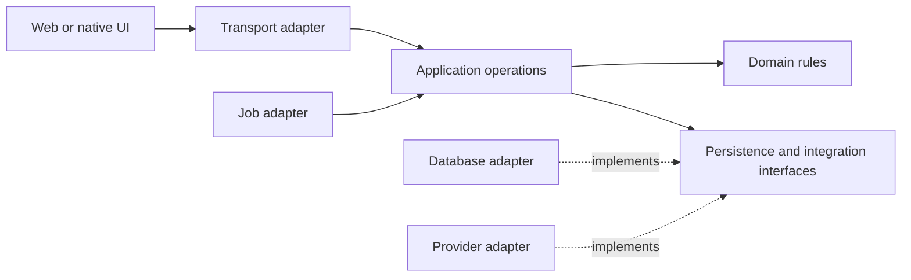

# P07: Architecture and domain modeling

Checked: 2026-09-29. Scope: organizing software so its business rules remain understandable, testable and changeable; choosing module, runtime and data boundaries; preserving rationale as products evolve.

This guide proposes Micro design policy. Domain-driven design, ports and adapters, C4 and architecture decision records are established methods with different purposes, not a mandatory architecture certification. The [installed kit](../../README.md) routes agents to design/spec artifacts and discipline skills; executable product-specific architecture rules remain to be implemented.

## Start with the domain and its invariants

Write the product's vocabulary before inventing a directory tree. Eric Evans' reference defines domain-driven design concepts including bounded contexts and ubiquitous language. Use these concepts to clarify where a word or rule has one consistent meaning; a bounded context does not require a separately deployed service. [Eric Evans' DDD reference](https://www.domainlanguage.com/wp-content/uploads/2016/05/DDD_Reference_2015-03.pdf).

For a budgeting app, ask whether an account means a login identity or a financial account; whether a transfer changes spending totals; whether a budget covers a calendar month or a custom period; and whether edited transactions preserve an audit history. These answers affect behavior and data semantics. Naming tables before resolving them creates avoidable rework.

Matt Pocock's domain-modeling skill encourages challenging ambiguous terms, testing them with scenarios and recording the resolved vocabulary. Current upstream names its glossary `GLOSSARY.md`; existing local repositories using `CONTEXT.md` need an explicit path adapter, not an automatic rename. Pin imported guidance and preserve repository conventions. [Pinned Matt domain-modeling skill](https://github.com/mattpocock/skills/blob/d81f3a183412e71a5b1e84ca21bc1a35eea03a60/skills/engineering/domain-modeling/SKILL.md).

Recommended domain artifacts:

| Artifact | Minimum useful content | When to create it |
| --- | --- | --- |
| Existing `CONTEXT.md` or configured glossary | Canonical terms, distinctions, rules and examples without infrastructure details | When the first important concept is resolved |
| Context map | Responsibilities, ownership, collaborators and permitted exchanges | When multiple meanings or subsystems need boundaries |
| Invariant table in the spec | What must remain true and which operation enforces it | Before implementing consequential behavior |
| Architecture decision record (ADR) | Context, alternatives, decision, status and consequences | For a meaningful choice that would be costly or surprising to reverse |
| Acceptance examples | Ordinary and boundary cases with expected outcomes from an independent source | Before implementation or a behavior change |

Do not create empty documents to simulate maturity. A solo app may need one vocabulary file, a module sketch and two decisions. Keep each decision close to the code it constrains.

## Prefer a modular monolith while boundaries are uncertain

Start with one deployable application when its requirements fit. Separate capabilities within that application and make their ownership explicit. Fowler's monolith-first argument is contextual advice: distributed services increase costs and useful boundaries are hard to know early. It does not establish that every product must begin as a monolith. [Monolith First](https://martinfowler.com/bliki/MonolithFirst.html).

Micro's extraction predicate should require a demonstrated need such as independent release ownership, incompatible runtime requirements, meaningful fault containment or measured scaling pressure. Record the new communication contract, consistency model and operational owner. A large file or the presence of two agents is insufficient justification for a microservice.

Avoid event sourcing, a general plugin system, a service mesh and a universal repository abstraction as starter defaults. Introduce them when a concrete requirement is easier to satisfy with the added machinery than without it. P08 records the data consequences; P11 and P14 record the operating consequences.

## Build deep modules at useful seams

Matt Pocock's codebase-design discipline treats an interface as everything a caller must understand, including invariants, ordering, errors and performance. Its useful measure is how much behavior callers receive through a small understandable surface, rather than counting implementation lines. [Pinned Matt codebase-design skill](https://github.com/mattpocock/skills/blob/d81f3a183412e71a5b1e84ca21bc1a35eea03a60/skills/engineering/codebase-design/SKILL.md).

Use domain-oriented modules with clear public operations. A budget module might expose `recordExpense`, `transferBetweenAccounts` and `summarizePeriod`; callers should not each reconstruct currency, transfer and period rules. Keep UI formatting, transport parsing and database mechanics outside those public business decisions.

Ports and adapters separates application behavior from the external technology that drives it or performs an effect. This supports tests, UI and batch operations using the same business interface. Apply the idea selectively rather than wrapping every function in an interface. [Alistair Cockburn's original ports-and-adapters article](https://alistair.cockburn.us/hexagonal-architecture).

Illustrative dependency direction, not a required folder layout:

Choose an interface when a real external dependency, test boundary or varying behavior needs one. Accept the clock, ID generator or provider dependency explicitly when deterministic testing requires substitution. Keep ordinary pure calculations simple. Prefer one local module over a sequence of pass-through modules whose callers must still coordinate the underlying details.

Poteto's upstream pstack `architect` skill asks for usage/type sketches and distinct design alternatives before filling in implementation; its `blast-radius` skill asks for executable evidence of the facts a change's safety depends on. Adapt those practices into Micro's existing workflow without importing Cursor runner aliases or executing bundled automation. [Pinned pstack architect](https://github.com/cursor/plugins/blob/69cf06fa253ba0761213669171198968e51fb9ff/pstack/skills/architect/SKILL.md), [pstack blast-radius](https://github.com/cursor/plugins/blob/69cf06fa253ba0761213669171198968e51fb9ff/pstack/skills/blast-radius/SKILL.md).

For a consequential design, compare two structurally different approaches using caller examples, failure behavior, testability and change locality. State which assumption would invalidate the selected design. Once implementation contradicts that assumption, revisit the sketch instead of layering permanent exceptions around it.

## Document the running system and enforce important boundaries

C4 provides system, container, component and code views, plus supporting dynamic/deployment diagrams. In C4, a container is a running application or data store, not necessarily a Docker container. Use the smallest set of views that explains the product and its trust boundaries. [C4 model](https://c4model.com/), [C4 container abstraction](https://c4model.com/abstractions/container).

For the first product, a context diagram should show users and external systems; a deployment/runtime view should show application processes, stores and the identity boundary. A sequence for a payment, import or asynchronous job can reveal uncertainty that a box diagram hides. Keep generated diagrams tied to their source/config revision and retain explanatory rationale for choices diagrams cannot express.

Turn high-value architectural decisions into checks. Examples are domain code not importing the browser framework, server-only persistence not entering the client bundle, one module not reaching into another's private files, and application jobs using a bounded provider adapter. Dependency-cruiser can validate import rules in JavaScript/TypeScript repositories; its configuration must fit the actual source tree. [Dependency-cruiser](https://github.com/sverweij/dependency-cruiser).

Avoid enforcing a rigid folder shape as a proxy for modularity. A repository can satisfy folder rules while business invariants still leak across callers. Tests through the public operation and review of change locality provide complementary evidence.

## Record decisions and dependency ownership

Michael Nygard's ADR approach keeps significant decisions in short versioned records, retains superseded decisions and records consequences alongside rationale. Micro should adopt that structure while preserving its configured `docs/adr/` location. [Documenting Architecture Decisions](https://cognitect.com/blog/2011/11/15/documenting-architecture-decisions).

Every important dependency should have a purpose, ownership, license, version/update policy and replacement consequence. Favor an existing suitable implementation, standard library or native platform capability before adding a dependency. Ponytail explicitly preserves validation, error handling, security and accessibility while applying that necessity/reuse discipline. Treat its published benchmark results as its own experiments, not expected Micro savings. [Pinned Ponytail README](https://github.com/DietrichGebert/ponytail/blob/e3ba2aa6f1e6f0bc4d69eb09c9f0d0a93af56156/README.md).

Keep a dependency inventory separate from design rationale: an SBOM describes included components; it does not explain why they belong in the product. GitHub's dependency graph derives relationships from supported manifests/lockfiles or submitted dependency data. It is useful evidence but does not discover every runtime, service or dynamically downloaded asset automatically. [GitHub dependency graph](https://docs.github.com/en/code-security/concepts/supply-chain-security/dependency-graph).

## Acceptance proportional to architectural risk

| Change class | Required predicate | Evidence |
| --- | --- | --- |
| Local reversible feature | The public operation meets its spec and respects existing ownership | Relevant behavior checks and reviewer diff |
| New module or integration | Caller examples, failure semantics and real adapter behavior are exercised | Interface sketch, integration test and scoped decision |
| Cross-cutting refactor | Existing contracts survive; public/internal boundaries and hidden consumers are accounted for | Contract tests, dependency checks and executable blast-radius evidence |
| New service or data boundary | Partial failures, compatibility, authentication, consistency and recovery are specified and tested | ADR, runtime diagram, failure-injection evidence and P06/P08/P14 review |
| High-consequence invariant | No entry point can bypass enforcement; independent reviewer can reproduce the claim | Negative tests at each entry point and invariant proof where applicable |

A complexity score, lines of code or architectural style label is not acceptance. The relevant observable outcome is that a stated change can be made without duplicating the business rule, losing records or silently breaking a consumer.

## Factory upgrade sequence

1. Extend the selected starter with a configured glossary path and ADR template, creating content lazily. Route Matt's domain and module disciplines through the existing Micro workflow.
2. Add a module sketch and public-operation tests to the first vertical slice. Keep the spec, terminology and code consistent in the same change.
3. Admit a small set of import and server/client boundary checks independently. Demonstrate that a deliberate prohibited import fails them.
4. Review architecture when a change repeatedly crosses ownership boundaries or produces the same workaround. Choose and test a concrete improvement rather than scheduling a mandatory full rewrite.

The factory should retain rationale, enforce the few decisions that matter and detect real regressions. This guide has been researched and written; it does not claim that every proposed architectural check is installed.
